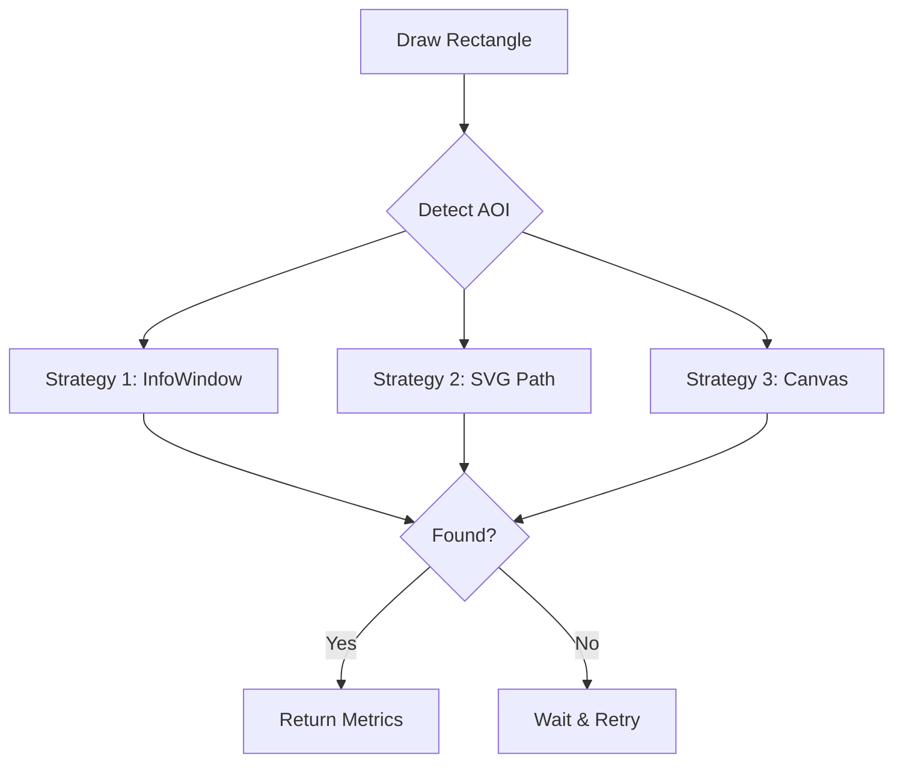
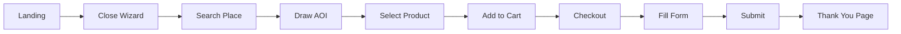
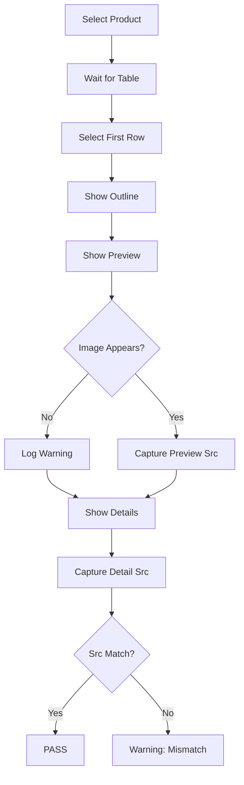

# 🛒 GeoWGS84 Datastore Automation Test Suite

  

This repository contains the end-to-end automation test suite for the **GeoWGS84 Datastore** application. It covers the primary e-commerce flow for satellite imagery, advanced map interactions, and administrative dataset validations.

---

## 📚 Table of Contents
1. [Test Architecture Overview](#test-architecture-overview)
2. [Test Suites Breakdown](#test-suites-breakdown)
   * [1. Shopping Cart & Checkout](#1-shopping-cart--checkout-datastorespecjs)
   * [2. Satellite Scenes Validation](#2-satellite-scenes-validation-datastorespecjs)
   * [3. Map Interactions & Utilities](#3-map-interactions--utilities-datastorespecjs)
3. [Key Logic & Selection Strategies](#key-logic--selection-strategies)
4. [Visual Flow Diagrams](#visual-flow-diagrams)

---

## 🏗️ Test Architecture Overview

The suite follows the **Page Object Model (POM)** to separate test logic from implementation details.
- **Pages:** `MapPage` (Draw, Search, Locate), `SatellitePage` (Scene Processing), `CartPage` (Checkout).
- **Helpers:** Centralized utilities for visual highlighting, step logging, AOI detection, and artifact management.
- **Reporting:** Integrated custom Email Reporter for detailed HTML reports with screenshot/video attachments on failure.

---

## 🧪 Test Suites Breakdown

### 1. Shopping Cart & Checkout (`datastore.spec.js`)

End-to-end validation of the purchase flow.

#### **TC-P0-1: Shopping Cart and checkout page**
1.  **Setup:** Navigates to `datastore.geowgs84.com`.
2.  **Map Flow:**
    *   **Action:** Closes initial wizard modal.
    *   **Action:** Searches for "Indore" using the search widget.
    *   **Selection:** Selects the first suggestion and waits for the map to pan.
    *   **AOI Logic:** Waits for the AOI toolbar -> Draws a bounding box rectangle.
    *   **Validation:** Asserts the InfoWindow appears with "area" text.
3.  **Product Selection:**
    *   **Action:** Opens the "Satellite Imagery" section.
    *   **Logic:** Waits for the product table to populate.
    *   **Action:** Clicks "Add to Cart" on the first available row.
    *   **Validation:** Checks for "Item added to cart" popup.
4.  **Checkout Flow:**
    *   **Action:** Opens Cart sidebar -> Clicks "Checkout".
    *   **Form Logic:** Fills Name, Email, Phone, Country, Purpose.
    *   **Submission:** Clicks "Submit".
    *   **Final Assertion:** Expects URL to contain `thank_you`.

---

### 2. Satellite Scenes Validation (`datastore.spec.js`)

A data-driven suite validating the metadata and imagery previews for multiple satellite constellations.

#### **TC-P0-2.x: Satellite Scenes — [WorldView01, WorldView02, etc.]**
*   **Data Loop:** Iterates through a list of 12 products (WorldView, GeoEye, QuickBird, etc.).
1.  **Setup:** Navigates to map -> Draws AOI (Search "Indore").
2.  **Product Selection:**
    *   **Action:** Opens Satellite section -> Clicks the specific product link (e.g., "WorldView01").
    *   **Validation:** Asserts the Scenes Table loads with rows.
3.  **Scene Processing (Core Logic):**
    *   **Action:** Selects the first scene row.
    *   **Step 1 (Outline):** Clicks "Show Outline".
        *   *Logic:* Clicks button -> Waits 500ms (allows map to render vector overlay).
    *   **Step 2 (Preview):** Clicks "Show Preview".
        *   *Logic:* Waits for `img[src*="browse"]` or `img[src*="sceneId"]` to appear on map (timeout: 90s).
        *   *Fallback:* If image fails, logs warning and proceeds to details.
        *   *Artifact:* Captures screenshot of the preview overlay on the map.
    *   **Step 3 (Details):** Clicks "Show Details".
        *   *Logic:* Waits for `SceneDetailModal`.
        *   *Wait:* Waits 5s for modal data to hydrate.
    *   **Step 4 (Comparison):**
        *   *Logic:* Extracts `src` of Preview Image and Detail Image.
        *   *Validation:* Asserts `PreviewSrc` matches `DetailSrc` (validates correct image is loaded).
        *   *Cleanup:* Closes modal.

---

### 3. Map Interactions & Utilities (`datastore.spec.js`)

Tests for core GIS functionalities located in the right-hand navigation bar.

#### **TC-P1-3: Search UI**
*   **Action:** Clicks Search Icon -> Fills "Indore" -> Selects Suggestion.
*   **Validation:** Asserts Search Input visibility and Map Load.

#### **TC-P1-4: Coordinates**
*   **Input:** Lat: `18.5246`, Lon: `73.8786`.
*   **Action:** Opens Coordinates Modal -> Fills inputs -> Clicks "Take Me".
*   **Validation:** Asserts a map marker (Blue Dot) is visible at the location.

#### **TC-P1-5: Upload KMZ**
*   **Setup:** Uploads `MadhyaPradesh.kmz`.
*   **Logic:** Clicks randomly on the map until an InfoWindow appears (max 15 attempts).
*   **Validation:** Asserts InfoWindow visibility.

#### **TC-P1-6: Locate (Geolocation)**
*   **Setup:** Grants geolocation permissions via context.
*   **Mock Location:** Sets coordinates (22.7196, 75.8577) (India).
*   **Action:** Clicks "Locate" button.
*   **Validation:** Asserts Blue Marker is visible on the map.

#### **TC-P1-7: Hover Locationer**
*   **Action:** Enables "Hover Location" toggle.
*   **Logic:** Moves mouse in a grid pattern over the map.
*   **Validation:** Asserts `#position_on_hover` element contains text matching `Latitude: ... Longitude: ...`.

#### **TC-P1-8: AOI View (Zoom Logic)**
*   **Setup:** Draws an AOI.
*   **Metrics Capture:** Records AOI Bounding Box (X, Y, Area).
*   **World View Flow:**
    *   **Action:** Clicks "World View".
    *   **Validation:** Asserts AOI moves significantly (shift > 50px) or shrinks.
*   **AOI View Flow:**
    *   **Action:** Clicks "AOI View".
    *   **Validation:** Asserts AOI returns to original size/position (Area difference < 20%).

#### **TC-P1-9: AOI Info Window**
*   **Setup:** Draws AOI.
*   **Validation:** Checks Info Window presence.
*   **Action:** Closes Info Window -> Clicks "Delete All".
*   **Validation:** Asserts Info Window is removed.

---

## 🧠 Key Logic & Selection Strategies

### 1. Resilient AOI Detection
The suite uses multiple strategies to detect if an Area of Interest (AOI) is successfully drawn on a Google Map, handling both standard vector layers and specific InfoWindow popups.


### 2. Dynamic Visual Validation
Instead of just checking DOM elements, the suite validates visual states:
*   **Warning/Error Overlay:** If a warning occurs during a step, a modal overlay is painted on the screen, a screenshot is taken, and the modal is removed before proceeding.
*   **Video Evidence:** Videos are only attached to the email report if the test status is "Failed" or "Warning", saving storage.

### 3. Image Comparison Logic
For satellite scenes, the test performs a content validation:
1.  Trigger **Preview** on Map -> Extract Image `src`.
2.  Trigger **Details** Modal -> Extract Image `src`.
3.  **Assert:** `PreviewSrc` == `DetailSrc`.

---

## 📊 Visual Flow Diagrams

### Shopping Cart Flow


### Scene Processing Flow


---

## 🛠️ Setup & Execution

### Prerequisites
*   Node.js (v18+)
*   Playwright

### Installation
```bash
npm install
npx playwright install
```

### Running Tests
```bash
# Run all tests
npx playwright test

# Run specific flow
npx playwright test -g "Shopping Cart"

# Run in UI Mode
npx playwright test --ui
```
